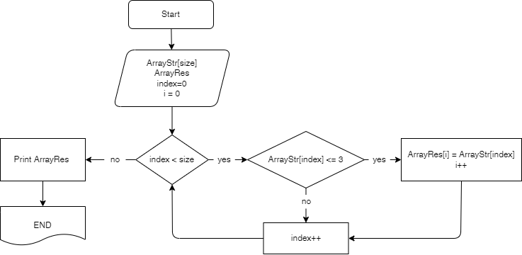

# Итоговая проверочная работа.
Данная работа необходима для проверки ваших знаний и навыков по итогу прохождения первого блока обучения на программе разработчик. Мы должны убедиться, что базовое знакомство с it прошло успешно.

Задача алгоритмически не самая сложная, однако, для полноценного выполнения проверочной работы необходимо:
1.	Создать репозиторий на GitHub
2.	Нарисовать блок-схему алгоритма (можно обойтись блок-схемой основной содержательной части, если вы выделяете ее в отдельный метод)
3.	Снабдить репозиторий оформленным текстовым описанием решения (файл README.md)
4.	Написать программу, решающую поставленную задачу
5.	Использовать контроль версий в работе над этим небольшим проектом (не должно быть так что все залито одним коммитом, как минимум этапы 2, 3 и 4 должны быть расположены в разных коммитах)

**Задача:**
Написать программу, которая из имеющегося массива строк формирует массив из строк, длина которых меньше либо равна 3 символа. Первоначальный массив можно ввести с клавиатуры, либо задать на старте выполнения алгоритма. При решении не рекомендуется пользоваться коллекциями, лучше обойтись исключительно массивами.

#
## Алгоритм выполнения проверочной работы:
1. Был создан удаленный репозиторий на GitHub: *FinalControlWork*
2. Блок-схема алгоритма:

3. Создан файл *readme.md* с описанием
4. Написана программа с решением задачи: *Program.cs*
5. Использован контроль версий: созданно 5 коммитов

#
## Решение задачи:

**Ввод массива (*ArrayStr*):**
Массив задается двумя способами:
1. Пользователь вводит строки для массива самостоятельно
2. Случайная генерация массива строк из заданных символов

Данный ввод реализован методом ввода с клавиатуры: если пользователь желает ввести массив вручную, он выбирает значение "*yes*":
- задает желаемый размер своего массива. Создан метод *__InputMessage__*
- Заполняет свой массив. Создан метод *__FillArray__*,

При вводе значения *"no"* или любого другого нажатия клавиш — генерируется случайный массив.

*Можно ограничить пользователя вводом значениея с помощью цикла __"while"__: каждый раз запрашивать ввод, пока не будет введено верное (__"yes"__ или __"no"__)*. 

**Вывод итогового массива:**
1. Создаем массив *__ArrayRes__* — итоговый массив, удовлетворяющий условиям задачи
2. Используем созданный метод  *__Sorted__*: проверяет условия задачи и добавляет удовлетворяющие значения в новый массив.
3. Метод *__PrintArray__*: выводит массив (*ArrayStr* и *ArrayRes*) в терминал